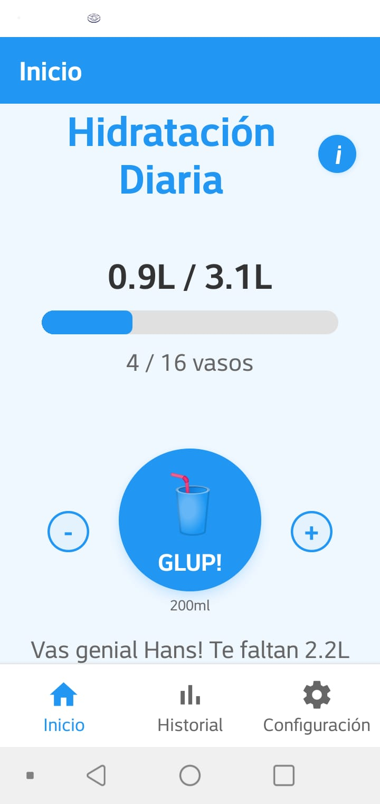
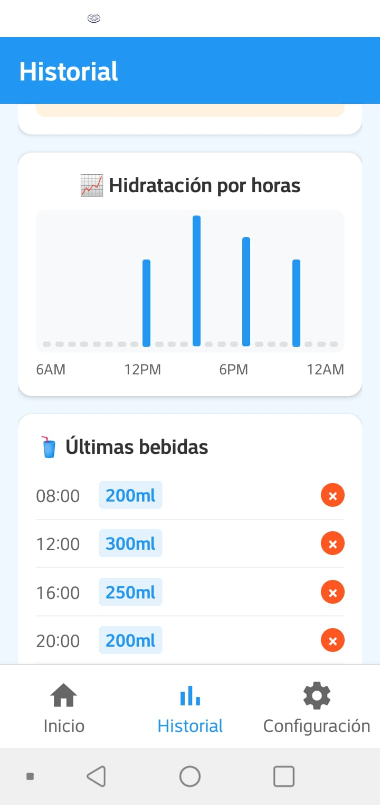
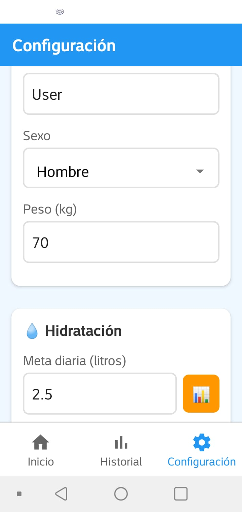

<div align="center">
  
  <h1>💧 GLUP Water Reminder</h1>
  <p><em>Tu compañero inteligente para mantenerte hidratado</em></p>
</div>

## 📱 Acerca de la App

**GLUP Water Reminder** es una aplicación móvil intuitiva que te ayuda a mantener una hidratación saludable a lo largo del día. Con un diseño elegante y funcionalidades inteligentes, hace que beber agua sea fácil y divertido.

### ✨ Características Principales

- 🥤 **Botón GLUP interactivo** - Registra tu consumo de agua con un toque
- 📊 **Seguimiento inteligente** - Visualiza tu progreso diario con gráficos
- ⏰ **Recordatorios personalizados** - Notificaciones basadas en tu horario
- 🧮 **Calculadora de hidratación** - Meta personalizada según peso, actividad y clima
- 📈 **Historial completo** - Analiza tus patrones de hidratación
- 🔊 **Sonidos personalizables** - Glup clásico, gotas de agua o burbujas
- 🌍 **Bilingüe** - Español e Inglés
- 💡 **Tips de hidratación** - Consejos prácticos para mantenerte saludable
- 🎯 **Onboarding inteligente** - Configuración inicial personalizada para nuevos usuarios
- ⚡ **Auto-cálculo de metas** - Actualización automática basada en tu perfil
- 💾 **Guardado inteligente** - Feedback visual durante operaciones de guardado

## 🎆 Novedades v1.1.0

- ✅ **Pantalla de onboarding para nuevos usuarios** - Configuración inicial personalizada
- ✅ **Cálculo automático de meta diaria** - Basado en peso, género, actividad y clima
- ✅ **Auto-actualización de meta en configuración** - Recalcula automáticamente al cambiar parámetros
- ✅ **Spinner de carga al guardar cambios** - Feedback visual durante operaciones
- ✅ **Mejor UX en configuración** - Interfaz mejorada y más intuitiva
- ✅ **Configuración de builds para producción** - Optimizaciones para APK final
- ✅ **Historial ampliado a 30 días** - Nueva opción para consultar el registro completo del último mes

## 🛠️ Tecnologías Utilizadas

- **React Native** - Framework multiplataforma
- **Expo** - Plataforma de desarrollo y deployment
- **TypeScript** - Tipado estático para JavaScript
- **AsyncStorage** - Persistencia de datos local
- **Expo Notifications** - Sistema de notificaciones push
- **Expo AV** - Reproducción de audio
- **React Navigation** - Navegación entre pantallas

## 📥 Descargar APK

Descarga la última versión de la aplicación desde la carpeta [releases/](./releases/)

## 🚀 Instalación para Desarrollo

```bash
# Clonar el repositorio
git clone https://github.com/Hans-Rafael/glup-water-reminder.git

# Navegar al directorio
cd glup-water-reminder

# Instalar dependencias
npm install

# Ejecutar en desarrollo
npx expo start
```

## 📱 Generar APK

```bash
# Instalar EAS CLI
npm install -g eas-cli

# Login en Expo
eas login

# Generar APK
eas build --platform android --profile preview
```

## 🎯 Fórmula de Hidratación

La app utiliza la **regla científica del 80%** para calcular tu meta diaria:

```
Meta Base = (Peso × 35ml) × 0.8
+ Ajustes por género (+500ml hombres, +300ml embarazadas)
+ Ajustes por actividad (+500ml moderada, +1L alta)
+ Ajustes por clima (+750ml clima caluroso)
```

## 📸 Capturas de Pantalla

<div align="center">
  <table>
    <tr>
      <td align="center"><strong>Pantalla Principal</strong></td>
      <td align="center"><strong>Historial</strong></td>
      <td align="center"><strong>Configuración</strong></td>
    </tr>
    <tr>
      <td></td>
      <td></td>
      <td></td>
    </tr>
  </table>
</div>

## 🤝 Contribuir

Las contribuciones son bienvenidas. Por favor:

1. Fork el proyecto
2. Crea una rama para tu feature (`git checkout -b feature/AmazingFeature`)
3. Commit tus cambios (`git commit -m 'Add some AmazingFeature'`)
4. Push a la rama (`git push origin feature/AmazingFeature`)
5. Abre un Pull Request

## 📄 Licencia

Este proyecto está bajo la Licencia MIT. Ver el archivo [LICENSE](LICENSE) para más detalles.

## 👨‍💻 Autor

**Hans Rafael** - [@Hans-Rafael](https://github.com/Hans-Rafael)

---

<div align="center">
  <p>💧 <strong>Mantente hidratado, mantente saludable</strong> 💧</p>
  <p>Hecho con ❤️ usando React Native Y Expo</p>
</div>